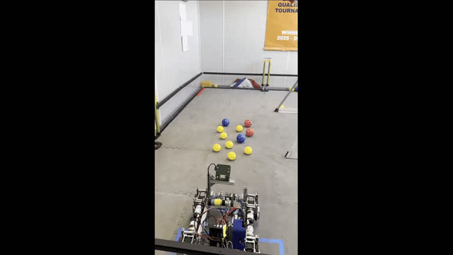

# API — `ftc_ball_chase_lib`

The library turns a Limelight 3A ball sighting into a robot action you call
from TeleOp or autonomous. Two layers, both copied from `ftc_ball_chase_lib/`:

- **`final/`** — ship-ready drivers (`package org.firstinspires.ftc.teamcode`):
  `BallTracker` (perception), `BallChaseController` (no-odometry chase),
  `BallChaseFollower` + `BallHunt` (Pedro auto).
- **`wrapper/`** — the fluent verb API: `BallWrangler` +
  `PedroWrangler` / `MecanumWrangler` (`package ...teamcode.wrapper`).

Tuning never requires code archaeology: **every** constant lives in
`final/HiveConfig.java` — one block per driver's defaults.

## Most teams need only these 3 things

### 1. The one-liner — collect balls in auto (Pedro)

```java
int picked = new BallHunt(follower, limelight, intake)
        .reds().collect(2).within(20)
        .go(this);          // BLOCKING: owns follower.update(), reads cleanly
```

Intended for `LinearOpMode.runOpMode()` after `waitForStart()`. It drives,
picks, streams telemetry, aborts on stop, and returns the count.

### 2. The loop chase — no odometry, any drivetrain

```java
BallTracker tracker = new BallTracker(limelight);
tracker.setAllowedClasses(BallTracker.CLASSES_RED_BLUE);

BallChaseController chase = new BallChaseController(tracker, lf, rf, lb, rb, intake);
chase.setMaxPickups(3);
chase.start();
while (opModeIsActive() && !chase.isDone()) { chase.update(); }
chase.abort();
```

Pure camera chase — no localizer needed. Right for teleop pickup and short
autos ([chasers.md](chasers.md)).

### 3. Just tracking — "can it see the right ball?"

```java
BallTracker tracker = new BallTracker(limelight);
tracker.setAllowedClasses(BallTracker.CLASS_RED, BallTracker.CLASS_BLUE);
tracker.requireConfirmation(4);                 // optional: same ball 4 frames
while (opModeIsActive()) {
    BallTracker.Sighting s = tracker.update();  // once per loop
    if (tracker.hasConfirmedTarget()) {
        telemetry.addData("target", "cls=%d tx=%+.1f dist=%.0f",
                s.classId, s.txDeg, s.distIn);
    }
    telemetry.update();
}
```

The `BallTracker` class reference — lock, confirmation, `Sighting`,
`DetectionSource` — is [ball_tracker.md](ball_tracker.md).

## Class index

| Class | Layer | Page | What it does / use it when |
|-------|-------|------|----------------------------|
| [`BallTracker`](ball_tracker.md) | `final/` | perception core | just read a target — `update()` once per loop; one ball per frame (confidence + staleness gating, color-bound target lock, multi-frame confirmation), ground range, `Sighting` |
| [`BallChaseController`](chasers.md) | `final/` | no-odometry chase | pure camera chase — teleop assist or a short pickup phase; no localizer needed |
| [`BallChaseFollower`](chasers.md) | `final/` | Pedro auto hybrid | a Pedro auto that plans paths — you own `follower.update()`; camera finishes |
| [`BallHunt`](chasers.md) | `final/` | one-liner | collect balls in one line — `.go(this)` |
| [`BallWrangler`](wrapper.md) | `wrapper/` | fluent verb API | prose-like chains — `grab(RED).within(6)`; `withPickupConfirmer(...)` for sensor-verified pickups |
| [`PedroWrangler` / `MecanumWrangler`](wrapper.md) | `wrapper/` | motion providers | only the physical motion, under the wrapper |

## Blocking vs loop-driven & lifecycle

- **`.go(opMode)` BLOCKS.** It owns the whole loop; for Pedro it also owns
  `follower.update()`. Call it from inside a `LinearOpMode` after
  `waitForStart()`. Do **not** call it from the `loop()` of an OpMode, and
  don't try to run vision yourself at the same time.
- **Loop-driven** (`start()` / `update()` / `abort()` / `isDone()`) is for
  when you must keep your own loop — you then OWN the drivetrain's loop hook
  (`follower.update()` for Pedro) and drive the tracker/state machine once per
  loop.
- **Nothing here spawns threads.** All classes are polled from your loop; the
  Limelight SDK does its own background reading, which is why gating on
  `staleness` matters (see [ball_tracker.md](ball_tracker.md)).

```text
create → configure (setAllowedClasses / .collect(n).within(sec))
       → waitForStart()
       → start() → update() … until isDone()     (loop-driven)
       → or go(opMode)                            (blocking)
       → abort()
```

`abort()` zeroes motors and the intake from every state — safe to call
unconditionally at the end of an OpMode.

## Coordinate & calibration note

One-block calibration lives in `final/HiveConfig.java`; the literal way to
measure `CAM_H`, `BALL_H`, `CAM_PITCH_DEG`, and the offsets — plus the sign
conventions for every frame — is in
[Calibration & coordinates](../docs/calibration.md). Get those signs right
once and the robot never drives backwards on you.

## See the API in action

[`demo/probiotix_api_robot_drive.mp4`](../demo/probiotix_api_robot_drive.mp4)
shows a robot drive coded using these classes — footage provided by
**Team 16765 ProBotiX** (probotixbladel@gmail.com); thank you for the footage.

